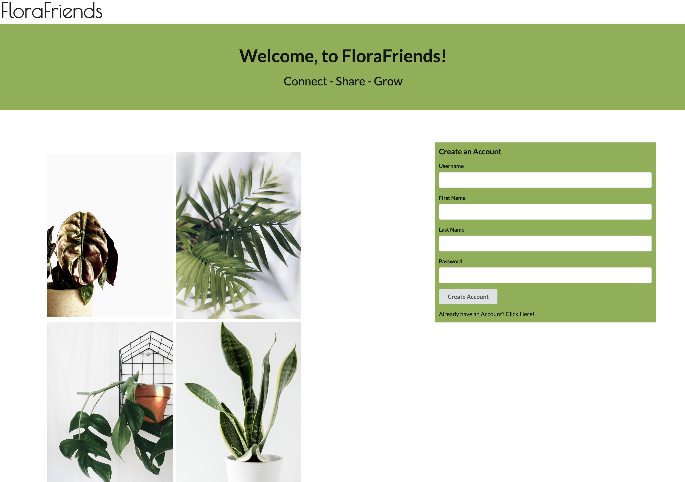

# FloraFriends

Welcome to FloraFriends, your next social media destination! Create an account, add plants to your shelf, and keep a log of your plant care! With version 1, you are able to see all users and their respective plants. Within your own personal profile, you are able to keep a record of your own care logs. Whether you are pruning, watering, fertilizing, or repotting you can have a convienent record to reflect on if needed.

## Getting Started

Once you have the repo forked and cloned down to your local machine, open your terminal and confirm that you are in the parent directory of the repo, then.

    cd server

    pipenv install

    pipenv shell

This command wil install all server side dependencies that are needed for the project and start the virtual enviornment for your application.

Confirm you are still within your server folder, if you are not, cd into it and run the following.

    flask db init

    flask db migrate -m 'initial'

    flask db upgrade head

    python seed.py
    
    python app.py

The above commands will initialize the database, seed it, along with start the backend database to be used.

Next, we need to get the client side of things up and running. Open a new terminal and enter the following. 

    cd client

    npm install

If you have completed the server side commands and have the server side up and running in another terminal, you are ready to start the app! In the same client terminal, run the following!

    npm start

## Future Development

- Introduce a 'friends' table to enable connectivity
- Introduce photo technology to allow users to upload a photo to their care log/profile
- Expand plant database
- Allowing users to comment/like a plant care
